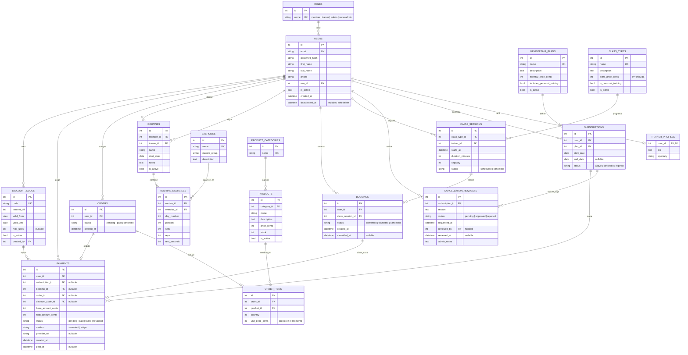

## Modelo de datos

El esquema tiene **18 tablas en tercera forma normal (3FN)**: 11 entran en el sprint 1 (núcleo) y 7 en el sprint 2 (bajas, tienda y pagos). El bloque Mermaid se puede pegar tal cual en el README de GitHub, que lo renderiza como diagrama ER.

### Qué tablas entran en cada sprint

| Sprint | Tablas |
| --- | --- |
| 1 — núcleo | roles, users, trainer_profiles, membership_plans, subscriptions, class_types, class_sessions, bookings, exercises, routines, routine_exercises |
| 2 — negocio | cancellation_requests, product_categories, products, orders, order_items, discount_codes, payments |

### Decisiones de normalización

- **1FN, valores atómicos:** los ejercicios de una rutina no van en un campo de texto separado por comas, sino en `routine_exercises`, una fila por ejercicio, día y posición.
- **2FN, dependencia de la clave completa:** en las tablas puente (`order_items`, `routine_exercises`) cada atributo depende del par completo. Se usa un `id` propio más una restricción `UNIQUE` sobre el par: `UNIQUE(order_id, product_id)` y `UNIQUE(routine_id, day_number, position)`.
- **3FN, sin dependencias transitivas:** los nombres de rol viven en `roles` y las categorías en `product_categories`, no repetidos como texto.
- **No se guarda nada derivable:** las plazas ocupadas se cuentan (`bookings` confirmadas), la posición en la lista de espera sale de ordenar por `created_at`, el total de un pedido es la suma de sus líneas y los usos de un código se cuentan en `payments`. Guardarlos sería duplicar datos que pueden desincronizarse.
- **La baja cuelga de la suscripción, no del usuario:** el socio se obtiene a través de `subscriptions.user_id`, así que `cancellation_requests` no repite `user_id`.
- **Excepciones justificadas:** `order_items.unit_price_cents` y los importes de `payments` son una foto del precio en ese momento, no una redundancia; si mañana sube la proteína, el pedido de ayer no cambia. `payments.user_id` es una desnormalización consciente para listar "mis pagos" y filtrar en administración sin unir tres tablas; el servicio comprueba que coincide con el dueño de la suscripción, reserva o pedido.
- **Un pago, un concepto:** `CHECK` que obliga a que exactamente uno de `subscription_id`, `booking_id` y `order_id` no sea nulo.
- **Soft delete:** el usuario nunca se borra; la baja aprobada pone `users.is_active = false`, rellena `deactivated_at` y pasa la suscripción a `cancelled`. Así se conserva el historial de pagos.

### Notas para SQLite

- Activar las claves foráneas en cada conexión (`PRAGMA foreign_keys = ON`); SQLite las ignora por defecto.
- El dinero en **céntimos enteros** (`*_cents`): SQLite no tiene tipo decimal y los `float` dan errores de redondeo.
- Los estados como texto con `CHECK (status IN (...))`, o `Enum` de SQLAlchemy, que genera ese `CHECK`.
- Fechas siempre en UTC; la conversión a hora de Madrid se hace en el frontend.